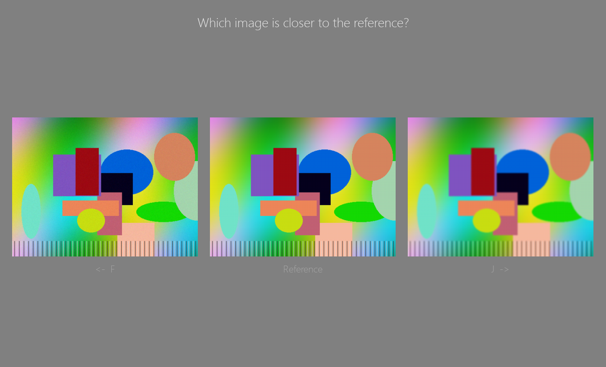
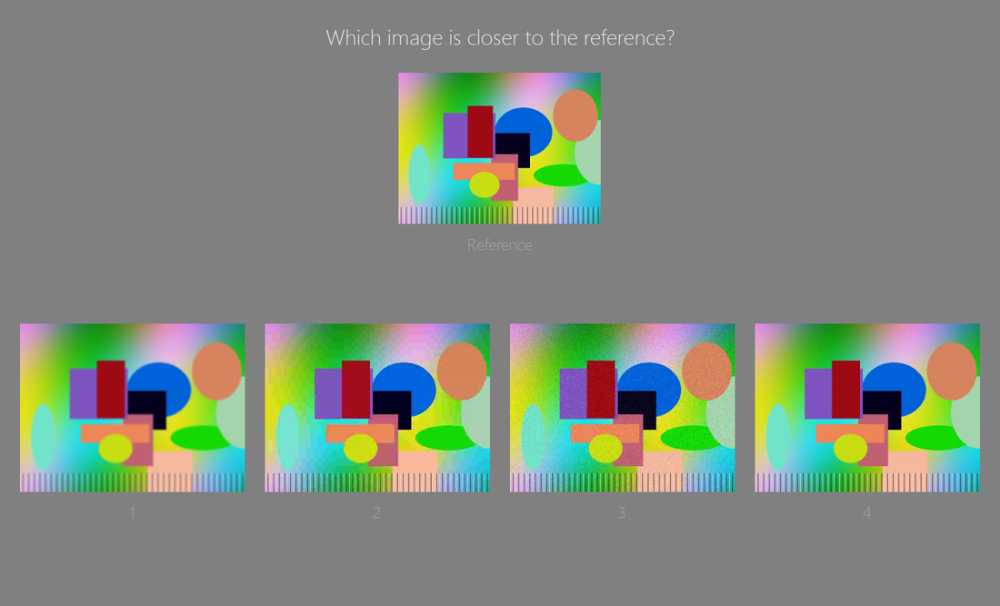
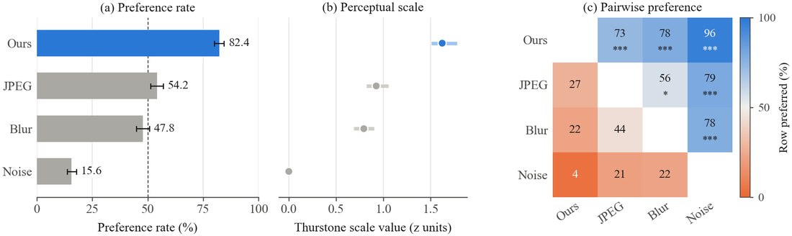

**[English](README.md) | [中文](README.zh-CN.md) | Español**

---

# Python Psychophysical Toolkit

Una herramienta en Python para hacer **estudios de usuario** de elección forzada que comparan métodos de procesamiento de imágenes, con un flujo similar a Psychtoolbox.

- Dos diseños de ensayo, elegidos con `mode` en la configuración: 

**pairwise** (2AFC) muestra dos resultados de método emparejados al azar, lado a lado (izquierda/derecha aleatorio), con una imagen de referencia opcional entre ellos; 

**all** (N-AFC) muestra el resultado de cada método para una escena a la vez en una fila, y el sujeto elige el mejor de todos — con una imagen de referencia opcional centrada en su propia fila encima. Es una prueba ciega — nunca se muestran los nombres de los métodos.

- Varios sujetos pueden participar uno tras otro; los resultados de cada uno se guardan en su propio archivo y nunca se sobrescriben.
- Análisis incluido: agrega los datos de todos los sujetos, aplica pruebas estadísticas y genera gráficos.
- Puede exportar figuras vectoriales con el tamaño de plantillas de artículos a dos columnas, junto con fragmentos de LaTeX listos para pegar.

## Inicio rápido

```bash
pip install -r requirements.txt
python make_demo_data.py                                     # genera imágenes de demostración
python experiment.py --config config/config_with_reference.json --adapt 60   # pairwise (2AFC)
python experiment.py --config config/config_all_methods.json --adapt 60      # all-at-once (N-AFC)
python analysis.py                                           # resultados -> analysis/
python paper_figure.py --ours Ours                            # figuras -> paper_figures/
```

Requiere Python 3.9 o superior.

## Archivos

| Archivo | Función |
|---|---|
| `experiment.py` | Ejecuta la sesión de un sujeto y guarda sus resultados |
| `analysis.py` | Agrega `results/`, genera tablas de estadísticas y gráficos |
| `paper_figure.py` | Exporta figuras vectoriales para el artículo y código LaTeX |
| `make_demo_data.py` | Genera imágenes de demostración para probar la herramienta |
| `simulate.py` | Simula datos de sujetos, para probar el flujo o estimar el tamaño de muestra |
| `config/config_with_reference.json` / `config/config_without_reference.json` | Configuraciones de ejemplo pairwise (con / sin imagen de referencia) |
| `config/config_all_methods.json` | Configuración de ejemplo para el diseño all-at-once (N-AFC) |

Carpetas de salida (se crean solas, excluidas de git): `results/`, `analysis/`, `paper_figures/`.

## Paso 1 — Organiza tus imágenes

Una subcarpeta por método, mismos nombres de archivo en todas:

```
my_study/
├── methods/              ← "root" en la configuración
│   ├── Ours/       001.png  002.png  003.png ...
│   ├── BM3D/       001.png  002.png  003.png ...
│   └── DnCNN/      001.png  002.png  003.png ...
└── reference/            ← opcional, "reference" en la configuración
    001.png  002.png  003.png ...
```

La coincidencia ignora la extensión (`001.png` = `001.jpg`). Una escena que falte en algún método (o en la referencia) se omite, con una advertencia. Usa `exclude` para descartar una subcarpeta, o `methods` para listar solo las que quieras.

## Paso 2 — Escribe un archivo de configuración

Copia `config/config_with_reference.json` (muestra "candidata | referencia | candidata"), `config/config_without_reference.json` (solo dos candidatas, sin referencia), o `config/config_all_methods.json` (todos los métodos a la vez — ver Paso 4) y edítalo. Cualquier opción de línea de comandos sobrescribe la clave correspondiente de la configuración, p. ej. `--adapt 5`.

Claves más usadas:

| Clave | Opción CLI | Por defecto | Significado |
|---|---|---|---|
| `mode` | `--mode` | pairwise | `pairwise` (2AFC) o `all` (todos los métodos a la vez, N-AFC) |
| `root` | `--root` | — | Carpeta con una subcarpeta por método |
| `reference` | `--reference` | ninguna | Carpeta de la imagen de referencia, o `null` para omitirla |
| `question` | `--question` | "Which image has better quality?" | Se muestra en cada ensayo |
| `adapt` | `--adapt` | 60 | Tiempo de adaptación a la luz (s); 0 para omitirlo |
| `n_trials` | `--n-trials` | todos | Muestrea solo este número de ensayos (balanceado entre pares en modo pairwise) |
| `seed` | `--seed` | aleatoria | Fíjala para un orden de ensayos reproducible |
| `fullscreen` | `--fullscreen` | false | Activar para el experimento real |
| `mouse` | `--mouse` | false | Permite responder haciendo clic en las imágenes (obligatorio si `mode: all` tiene más de 9 métodos) |

<details>
<summary>Lista completa de opciones de configuración</summary>

| Clave (opción CLI) | Por defecto | Descripción |
|---|---|---|
| `mode` (`--mode`) | pairwise | `pairwise` o `all` (ver Paso 4) |
| `root` (`--root`) | — | Carpeta raíz de métodos, una subcarpeta por método |
| `methods` (`--methods`) | — | Lista directamente las carpetas de métodos, en vez de `root` |
| `exclude` (`--exclude`) | ninguna | Subcarpetas a excluir al usar `root` |
| `reference` (`--reference`) | ninguna | Carpeta de referencia, o `null` para desactivarla |
| `question` (`--question`) | ver arriba | La pregunta del experimento |
| `instructions` (`--instructions`) | texto incorporado | Archivo de texto de instrucciones (UTF-8) |
| `adapt` (`--adapt`) | 60 | Duración de la adaptación a la luz (s); 0 la omite |
| `repeats` (`--repeats`) | 1 | Repeticiones del diseño completo — escenas × pares de métodos (pairwise) o solo escenas (all) |
| `n_trials` (`--n-trials`) | todos | Muestrea este número de ensayos, balanceado entre pares (pairwise) o escenas (all) |
| `seed` (`--seed`) | aleatoria | Fíjala para un orden de ensayos reproducible |
| `fixation` / `iti` | 0.5 / 0.3 | Duración de la fijación, intervalo entre ensayos (s) |
| `duration` (`--duration`) | 0 | Tiempo de presentación de la imagen (s); 0 = hasta responder |
| `break_every` (`--break-every`) | 50 | Ensayos entre descansos; 0 desactiva los descansos |
| `show_progress` | false | Muestra el progreso en la esquina inferior derecha |
| `mouse` (`--mouse`) | false | Permite responder con clic del ratón |
| `fullscreen` (`--fullscreen`) | false | Recomendado para el experimento real |
| `window` (`--window W H`) | 1600 900 | Tamaño de la ventana sin pantalla completa |
| `bg` / `fg` | [128,128,128] / [230,230,230] | Color de fondo / texto (RGB) |
| `gap` (`--gap`) | 0.02 | Espacio entre imágenes, como fracción del ancho de pantalla |
| `upscale` (`--upscale`) | false | Permite ampliar las imágenes para llenar la pantalla |
| `out_dir` (`--out-dir`) | results | Carpeta de resultados |
| `--subject` (solo CLI) | entrada en pantalla | Define el código del sujeto directamente, sin pedirlo |
| `--dry-run` (solo CLI) | — | Solo revisa carpetas y cuenta ensayos, sin ejecutar nada |

El texto de instrucciones admite los marcadores: `{question}`, `{n_trials}`, `{break_every}`, `{ref_sentence}`, `{ref_hint}`, `{mouse_sentence}`, `{n_methods}` — todos se rellenan automáticamente. Con `mode: all` y sin `--instructions` personalizado, se usa una plantilla incorporada que describe las respuestas con teclas numéricas, en vez de la plantilla pairwise.
</details>

## Paso 3 — Ejecución de prueba

```bash
python experiment.py --config config/config_with_reference.json --dry-run     # revisa carpetas y nº de ensayos, sin ventana
python experiment.py --config config/config_with_reference.json --adapt 5 --n-trials 10   # pruébalo tú mismo
```

El número de ensayos impreso depende de `mode`: pairwise es `escenas × M(M−1)/2 × repeticiones`, all es solo `escenas × repeticiones` (ver Consejos de diseño). Los resultados de la prueba también se guardan en `results/` — bórralos antes del experimento real.

## Paso 4 — Ejecuta el experimento real

Ejecútalo una vez por sujeto:

```bash
python experiment.py --config config/config_with_reference.json
```

Flujo: nombre → confirmar código de guardado → instrucciones (espacio para continuar) → adaptación a la luz → ensayos (fijación → imágenes → respuesta) → fin.

Con `mode: all` y una imagen de referencia, la disposición es de dos filas: la referencia centrada en su propia fila, con cada candidato lado a lado en una fila debajo. Capturas reales de un ensayo (usando las imágenes de demostración) que muestran la diferencia entre ambos diseños:

| `mode: pairwise` | `mode: all` |
|---|---|
|  |  |
| dos candidatas por ensayo, referencia entre ellas | todas las candidatas a la vez, referencia en su propia fila arriba |

**Teclas (`mode: pairwise`):** `←`/`F` = izquierda, `→`/`J` = derecha, `ESC` = salir en cualquier momento.
**Teclas (`mode: all`):** `1`–`9` = elige la imagen bajo ese número, `ESC` = salir en cualquier momento. Con más de 9 métodos es obligatorio `--mouse` (las teclas numéricas solo llegan a 9 posiciones); con `mouse: true` también puedes hacer clic en cualquier imagen en ambos modos.

Los resultados de cada sujeto se guardan en `results/<nombre>.csv` (los duplicados se renombran automáticamente a `<nombre>_2`, etc. — nunca se sobrescriben). El progreso se guarda después de cada ensayo, así que no se pierde nada si un sujeto sale antes de terminar.

## Paso 5 — Analiza los datos

```bash
python analysis.py
```

Lee todo lo que hay en `results/` y escribe en `analysis/` (ambos diseños pueden mezclarse en la misma carpeta — ver Estadística más abajo):

- **`results.png`/`.pdf`** — tasa de elección, escala de Thurstone, matriz de preferencia por pares, desglose por escena
- **`per_subject.png`** — revisión de consistencia entre sujetos
- **`method_summary.csv`, `pairwise_tests.csv`, `preference_matrix.csv`, `per_scene.csv`, `per_subject.csv`**

Vuelve a ejecutarlo cada vez que se añada un sujeto — siempre relee todo `results/`. Opciones útiles: `--boot-unit scene` (remuestreo más conservador), `--question "..."` (imprime la pregunta en las figuras).

## Paso 6 — Figuras para el artículo

```bash
python paper_figure.py --ours Ours
python paper_figure.py --ours Ours --rename Blur="Gaussian blur" --order Ours BM3D DnCNN
```

Genera PDFs vectoriales (+ vistas previas PNG) con el tamaño de plantillas de artículos a dos columnas, además de `latex_snippets.tex` con bloques `\includegraphics` y leyendas listos para pegar:

| Archivo | Tamaño | Contenido |
|---|---|---|
| `fig_preference_rate.pdf` | columna única | Tasa de elección por método |
| `fig_scale.pdf` | columna única | Valores de la escala de Thurstone |
| `fig_pairwise.pdf` | columna única | Matriz de preferencia por pares |
| `fig_ours_vs.pdf` | columna única | Tu método frente a cada método base |
| `fig_overview.pdf` | ancho completo | Los tres paneles combinados |

Ejemplo de `fig_overview` (vista previa PNG), con datos de demostración de `simulate.py`:



Opciones clave: `--ours NAME` (resalta y genera `fig_ours_vs`), `--rename carpeta=etiqueta`, `--order A B C`, `--font serif|sans`, `--font-size N`.

En LaTeX, define el tamaño con `\linewidth` / `\textwidth` — las figuras ya están dibujadas exactamente a ese tamaño, así que no se reescalan.

## Formato de los datos

Una fila por ensayo, un CSV por sujeto. El esquema depende de `mode`:

**`mode: pairwise`**

| Columna | Significado |
|---|---|
| `subject`, `trial`, `scene` | Código del sujeto, índice del ensayo, nombre de la escena |
| `left` / `right` | Métodos mostrados en cada lado |
| `chosen` / `not_chosen` | Cuál fue elegido |
| `chosen_side`, `rt`, `reference`, `scale`, `timestamp` | Lado elegido, tiempo de respuesta, si había referencia, escala de visualización, hora |

**`mode: all`**

| Columna | Significado |
|---|---|
| `subject`, `trial`, `scene` | Código del sujeto, índice del ensayo, nombre de la escena |
| `shown` | Todos los métodos candidatos, unidos con `;`, en el orden de visualización de izquierda a derecha |
| `chosen` | El método ganador |
| `position`, `rt`, `reference`, `scale`, `timestamp` | Posición (base 1) de `chosen` dentro de `shown`, tiempo de respuesta, si había referencia, escala de visualización, hora |

Cualquier herramienta que produzca alguno de estos dos conjuntos de columnas (p. ej. PsychoPy) funciona con `analysis.py` / `paper_figure.py`, que detectan el formato por archivo — el mínimo requerido es `subject`, `chosen`, y `not_chosen` o `shown`. Ambos tipos de archivo pueden convivir en la misma carpeta `results/`; `analysis.py` expande cada ensayo de modo all en una comparación por pares por cada candidato perdedor antes de analizarlo (válido bajo independencia de alternativas irrelevantes, IIA). Si los dos diseños pertenecen a dos estudios distintos y no a un mismo estudio que compara ambos, usa un `out_dir` diferente para cada uno — separados por estudio, no por `mode` — para que datos no relacionados nunca se mezclen por accidente en el mismo análisis.

## Estadística, en breve

- **Tasa de elección** — victorias ÷ apariciones, como comparación por pares (en datos `mode: all`, cada ensayo cuenta como el ganador venciendo a cada otro candidato con el que se mostró). Intervalo de confianza de Wilson. 50% = promedio, comparable entre ambos modos.
- **Tasa de selección** (solo `mode: all`) — con qué frecuencia un método ganó literalmente los ensayos de N alternativas en los que participó; el nivel de azar es `1/n_candidatos`, no 50%.
- **Escala de Thurstone** — escala perceptual derivada de todas las comparaciones por pares (unidades z, el peor método = 0).
- **Bradley–Terry** — modelo alternativo por pares, reportado como referencia; suele coincidir de cerca con Thurstone.
- **Pruebas por pares** — prueba binomial de dos colas contra 50%, corregida con Holm. `*` p<.05, `**` p<.01, `***` p<.001.
- **`--boot-unit`** — sobre qué remuestrea el bootstrap: `trial` (por defecto — un ensayo completo de N alternativas y todas las comparaciones derivadas de él se remuestrean juntos, no por separado), `scene` (para generalizar entre tipos de imagen), o `subject` (se recomiendan 5+ sujetos).

## Consejos de diseño

- **Número de ensayos**: pairwise = escenas × M(M−1)/2 × repeticiones (M = nº de métodos); all = escenas × repeticiones. Usa `n_trials` para submuestrear si son demasiados.
- **Elegir el diseño** — `all` da un juicio directo de "el mejor de M" en muchos menos ensayos, pero cada ensayo produce menos observaciones por pares independientes y las imágenes se ven más pequeñas; es más práctico hasta unos 5–6 métodos (límite estricto: 9 sin `--mouse`).
- **Sujetos** — apunta a 15–30 o más. Usa `simulate.py` de antemano para estimar cuántos necesitas (también admite `--mode all`).
- **Visualización** — usa pantalla completa, con brillo/temperatura de color/distancia de visión fijos. Para evaluar calidad, muestra al 100% (atento al aviso "shown at xx%") — recorta las imágenes o quita la referencia si no entran.
- **Interfaz en otro idioma** — simplemente escribe `question` y el texto de instrucciones en tu idioma; el programa elige una fuente adecuada automáticamente.
- **Precisión de tiempo** — pygame no está sincronizado con el refresco de pantalla; para precisión de fotograma, recolecta los datos con PsychoPy y reutiliza `analysis.py` / `paper_figure.py` de este proyecto con esa salida.
